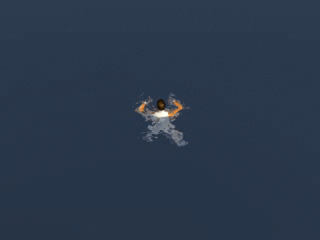

The Life Raft Simulator
=================================
Welcome to the development repository for the life raft simulator.

Read the [documentation](DOCUMENTATION.md)

Features
---------------------------------
* Open ocean
* Placeholder character
* Crude buoyancy
* Swim animations

Roadmap
---------------------------------
1. Water interaction
2. Life raft
3. A little less crude bouyancy (rotate the raft according to waves)
4. Raft boarding animation
5. Raft interaction (board, leave)

..more will be planned later

Prerequisities
---------------------------------

* Unity Personal

How to contribute
---------------------------------

The contribution process is based on forking this repository and sending pull requests when you have made enhancements that you wish to contribute back to the project.

Read more about [forking](https://help.github.com/articles/fork-a-repo/) and [pull requests](https://help.github.com/articles/using-pull-requests/).

